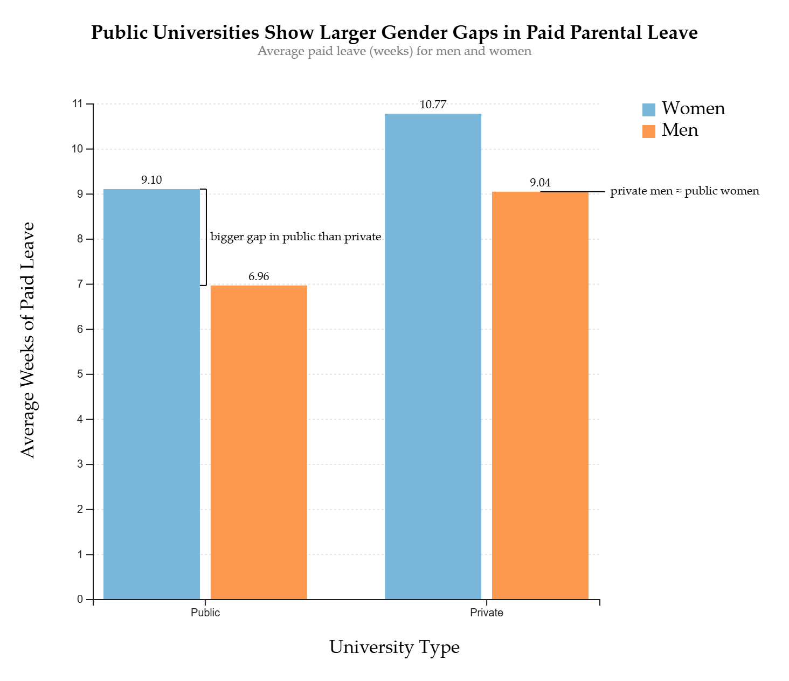

# Parental Leave Project

**Name: Kayla Tucker**  

---

## Dataset Description

The dataset used in this project looks at parental leave policies at universities. It includes details such as whether an institution is public or private, how many weeks of paid parental leave men and women receive, and other relevant factors, such as region and policy notes. The data comes from the Data on Paid Parental Leave Policies at US and Canadian Universities 2018 repository and can be found at: https://github.com/aaronclauset/parental-leave. For this analysis, I focused on the university type and the number of paid leave weeks for both women and men. Before starting the analysis, I removed missing or invalid values, such as "NA," to make sure the averages were calculated correctly and provided meaningful comparisons. The process can be seen in my Google Colab notebook for Milestone 2: https://colab.research.google.com/drive/1VRgWt1HWKY72h28szsWYfxs1YMzwx9df?usp=sharing

---

## Final Question / Finding

The main question for this project was whether public and private universities differ in gender equity regarding paid parental leave. I initially thought about asking, "Is there a large difference in the time off between maternity and paternity leave?" I found that it can be answered by looking at the public and private differences. I chose this topic since I work in higher education, and the data includes our university. 

Through analysis, I found that private universities generally offer more paid parental leave overall. However, public universities show a significantly larger gap in the amount of leave provided to women compared to men. This indicates that while private institutions may offer better benefits, they are relatively more balanced in the distribution of these benefits between genders. Even when hypothesizing, I never thought the benefits for men at private institutes would be so close to those for women at public institutes, but they ended up being extremely close.

Obviously, there is a lot of work to be done regarding the benefits women get at public institutions, as private institutions have set the standard of what is possible. There is almost even more to say about the lack of benefits that men are awarded at either institution. It sets an expectation that the husband shouldn't also get ample time to take care of the newborn, as it is more expected of the mother, which is problematic. 

---

## Final Visualization

---

## Link to Final Chart

The final interactive visualization can be accessed here: https://observablehq.com/d/669fe1ffb022b1a6

---

## Explanation of the Visualization

The final visualization is a grouped bar chart that compares the average number of weeks of paid parental leave offered to men and women at public and private universities. The x-axis represents the type of university, while the y-axis shows the average number of weeks of paid leave. Bars within each category are placed side by side for easy comparison between men and women. Color helps distinguish gender, making it simpler to see differences across categories. I kept the colors the same as my original draft in Milestone Two, as they are very distinguishable. 

The chart shows the main insight in the title: public universities have larger gender gaps in paid parental leave. This point is commented on through annotations, including a bracket that highlights the bigger difference in leave between men and women at public institutions. There is also a note indicating that private men receive leave amounts similar to public women, which was a more shocking insight. These annotations guide viewers to the most relevant comparisons without needing much interpretation. In my observable notebook, I made another visualization that separated public/private men and women, but I chose to keep the visualization above. It communicates my findings much more quickly. 

Along with the static design elements, I added interactive features to enhance usability. When a user hovers over a bar, all other bars fade, and the selected bar is highlighted. A tooltip shows the exact value, rounded to the nearest tenth, and the corresponding legend label is emphasized to strengthen the link between the visual representation and the data category. It even highlights the category name with its respective color. This interaction helps focus the viewer's attention and makes the chart easier to read.

The design of this final chart was based on earlier exploratory work done in my Google Colab notebook with Python. Using pandas, matplotlib, and seaborn, I tried line charts, grouped bar charts, boxplots, violin plots, and heatmaps to better understand the distribution and relationships within the data and to see which would communicate my findings best. These exploratory visualizations showed consistent gender differences and helped confirm that a grouped bar chart would be the clearest way to present the main comparison. However, the boxplot I presented in Milestone 2 provided valuable statistical insight that would be a strong aid to the visual above. 

---

## Final Thoughts

The development of this visualization involved an ongoing process of data exploration and design improvements. I spent several hours trying different approaches. A lot of that time went into fixing layout and alignment issues when moving to D3. One of the biggest challenges was ensuring the bars were grouped properly rather than stacked. I also had to refine annotations to ensure they conveyed clear insights without making the chart look cluttered. I'm not sure there are more tactful ways to produce annotations like brackets, but I created a version similar to my draft.

Another tough part was adding interactivity, especially coordinating hover effects between the bars and the legend. I needed to control selections and styling carefully to highlight only the relevant elements. This effort ultimately made the visualization clearer and improved the user experience.

Overall, this project showed me the value of ongoing design, careful annotation, and interactivity when helping users interpret the data. It also emphasized the importance of exploratory analysis in creating effective final visualizations.

---

## References
  
- https://d3js.org  
- https://observablehq.com/plot
- ODUCS Vis, https://observablehq.com/@oducs-vis?tab=notebooks
- Vega-Lite Chart Types, https://observablehq.com/d/eee8992f7a544136
- A Family-Friendly Policy That's Friendliest to Male Professors, https://www.nytimes.com/2016/06/26/business/tenure-extension-policies-that-put-women-at-a-disadvantage.html
- Unintended Help for Male Professors, https://www.insidehighered.com/news/2016/06/27/stopping-tenure-clock-may-help-male-professors-more-female-study-finds
- CS625 course material
- pandas 3.0.2 documentation, https://pandas.pydata.org/docs/
- Matplotlib 3.10.9 documentation, https://matplotlib.org/stable/index.html
- seaborn: statistical data visualization, https://seaborn.pydata.org/
- Previous class material about Java
- JavaScript documentation, https://devdocs.io/javascript/
- Grouped bar chart - Observable Plot, https://observablehq.com/@observablehq/plot-grouped-bar-chart
- Grouped bar chart / D3, https://observablehq.com/@d3/grouped-bar-chart/2
- Grammarly, https://app.grammarly.com/

